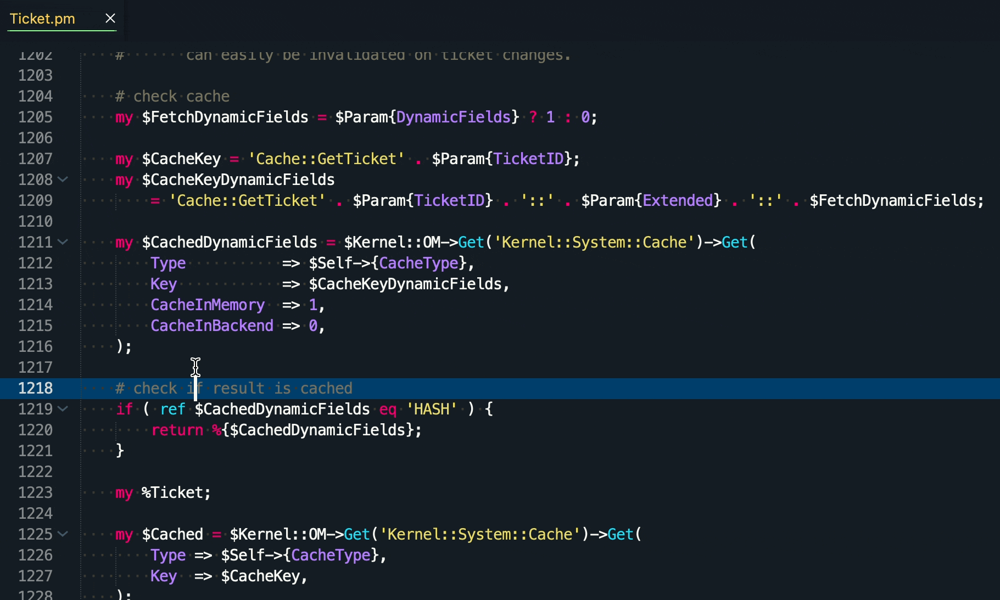

# QuoteWithMarker

**QuoteWithMarker** is a Sublime Text package that quotes the selected area and adds a custom marker to it.

| Repository | GitHub | Sublime Text |
| ------ | ------ | ------ |
|  |   |  |
|  |   |  |
|   |  |  |
|   |  |  |

| Status |
| ------ |
| [](https://github.com/dennykorsukewitz/Sublime-QuoteWithMarker/compare/1.0.2...dev)   |

## Feature

Sometimes you have to mark and comment code. Here is the QuoteWithMarker very helpful.
This function quotes the selected area and adds a custom marker to it.
This way you can still trace the original code.
There is also a start and end block for better display when merging.

`QuoteWithMarker` can be very useful especially for patch files.

**Shortcut:** ```strg + alt + k, q```<br>
**Command:**  ```QuoteWithMarker: Quote with Marker.```



### Settings

`Settings -> Package Settings -> Quote with Marker -> Settings`

| Name | Description | Default Value |
| - | - | - |
| code_marker | Code Marker used in QuoteWithMarker function. | `MyMarker - ${year}.${month}.${day}` |

---

## Installation

To install this package, you have **three** options:

### 1. Search Package via `Package Control`

Search and install online package via [Sublime Package Control](http://wbond.net/sublime_packages/package_control).

`Tools` -> `Command Palette` -> `Package Control: Install Package` -> simply search for `QuoteWithMarker` to install.

### 2. Install via sublime-package file

Download latest [sublime-package file](https://github.com/dennykorsukewitz/Sublime-QuoteWithMarker/releases) and move the package `QuoteWithMarker.sublime-package` to `Installed Packages` folder.

#### OSX

    cd ~/Library/Application\ Support/Sublime\ Text\ 2/Installed Packages/
    - or ST 3 -
    cd ~/Library/Application\ Support/Sublime\ Text\ 3/Installed Packages/

#### Linux

    cd ~/.config/sublime-text-2/Installed Packages
    - or ST 3 -
    cd ~/.config/sublime-text-3/Installed Packages

#### Windows

    cd "%APPDATA%\Sublime Text 2\Installed Packages"
    - or ST 3 -
    cd "%APPDATA%\Sublime Text 3\Installed Packages"

### 3. Source code

Clone the latest [dev branch](https://github.com/dennykorsukewitz/Sublime-QuoteWithMarker) and unpack it to Sublime Package folder `Packages`.

#### OSX

    cd ~/Library/Application\ Support/Sublime\ Text\ 2/Packages/
    - or ST 3 -
    cd ~/Library/Application\ Support/Sublime\ Text\ 3/Packages/
    git clone git@github.com:dennykorsukewitz/Sublime-QuoteWithMarker.git QuoteWithMarker

#### Linux

    cd ~/.config/sublime-text-2/Packages
    - or ST 3 -
    cd ~/.config/sublime-text-3/Packages
    git clone git@github.com:dennykorsukewitz/Sublime-QuoteWithMarker.git QuoteWithMarker

#### Windows

    cd "%APPDATA%\Sublime Text 2\Packages"
    - or ST 3 -
    cd "%APPDATA%\Sublime Text 3\Packages"
    git clone git@github.com:dennykorsukewitz/Sublime-QuoteWithMarker.git QuoteWithMarker

---

## Download

For download see [Sublime-QuoteWithMarker](https://github.com/dennykorsukewitz/Sublime-QuoteWithMarker/releases)

---

Enjoy!

Your [Denny Korsukéwitz](https://github.com/dennykorsukewitz) 🚀
